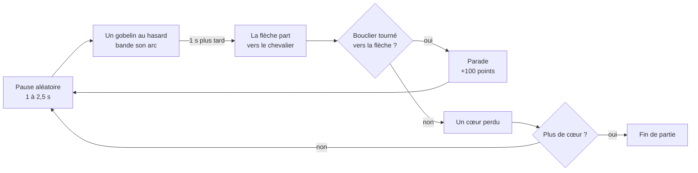
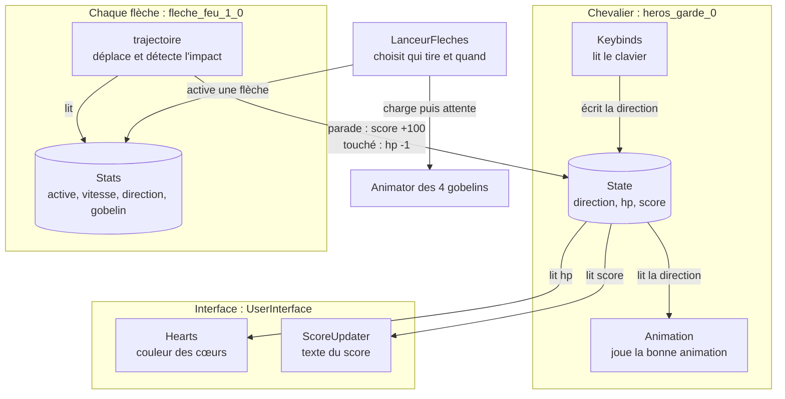
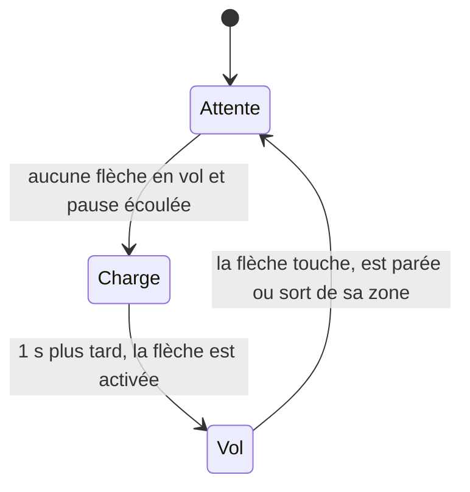
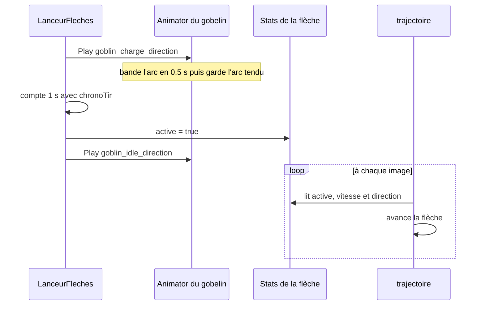

# Shield Hero — Documentation technique

Documentation du code et de l'organisation du projet Unity **Shield Hero**. La présentation du jeu (règles, commandes, version jouable) se trouve dans le [README](https://github.com/L4ami/shield-hero#readme).

Elle est écrite pour être lisible sans connaître Unity : chaque terme technique est expliqué à sa première apparition, et le lexique de la partie 2 les regroupe.

## Sommaire

1. [Le jeu en 30 secondes](#1-le-jeu-en-30-secondes)
2. [Petit lexique Unity et C#](#2-petit-lexique-unity-et-c)
3. [Organisation des fichiers](#3-organisation-des-fichiers)
4. [La scène Dungeon](#4-la-scène-dungeon)
5. [Architecture du code](#5-architecture-du-code)
6. [Les scripts, un par un](#6-les-scripts-un-par-un)
7. [Les animations](#7-les-animations)
8. [La map et l'éclairage](#8-la-map-et-léclairage)
9. [Réglages du gameplay](#9-réglages-du-gameplay)
10. [Problèmes rencontrés et solutions](#10-problèmes-rencontrés-et-solutions)
11. [Limites connues et pistes d'amélioration](#11-limites-connues-et-pistes-damélioration)

## 1. Le jeu en 30 secondes

Le joueur incarne un chevalier immobile au centre d'une salle de donjon. Quatre gobelins archers, placés en haut, en bas, à gauche et à droite, tirent chacun leur tour. Le chevalier ne se déplace pas : le joueur oriente seulement son bouclier dans l'une des 4 directions.

**La boucle de jeu**, c'est-à-dire ce qui se répète pendant toute la partie :



> **À retenir** : un jeu vidéo est une boucle. À chaque image affichée (environ 60 fois par seconde), le moteur met à jour chaque objet. Tout le gameplay de Shield Hero tient dans ce cycle : attendre, charger, tirer, vérifier l'impact, recommencer.

## 2. Petit lexique Unity et C#

| Terme | Explication |
|---|---|
| **Scène** | Un « niveau » du jeu : un fichier `.unity` qui contient tous les objets placés (ici `Dungeon.unity`). |
| **GameObject** | N'importe quel objet de la scène : le chevalier, une flèche, une lumière, la caméra. Seul, il ne fait rien : il porte des composants. |
| **Composant** | Une brique de comportement accrochée à un GameObject : `SpriteRenderer` (affiche une image), `Animator` (joue des animations), ou un de nos scripts. |
| **Script (MonoBehaviour)** | Un fichier C# dont la classe hérite de `MonoBehaviour` : Unity peut alors l'attacher comme composant à un GameObject. |
| **Inspector** | Le panneau de Unity qui affiche les composants de l'objet sélectionné et permet de régler leurs valeurs sans toucher au code. |
| **`Start()`** | Méthode appelée automatiquement **une seule fois**, au lancement de la scène. Elle sert à préparer le script. |
| **`Update()`** | Méthode appelée automatiquement **à chaque image** (frame). C'est là que vit la logique du jeu. |
| **Image (frame)** | Une image calculée puis affichée par le jeu. À 60 images par seconde, `Update()` tourne 60 fois par seconde. |
| **`Time.deltaTime`** | Le temps écoulé depuis l'image précédente, en secondes (environ 0,0167 s à 60 images/s). Multiplier une vitesse par ce nombre donne le même mouvement sur un PC rapide ou lent. |
| **`[SerializeField]`** | Mot-clé placé devant une variable privée pour l'afficher quand même dans l'Inspector. |
| **Sprite, planche de sprites** | Un sprite est une image 2D. Une planche (sprite sheet) regroupe toutes les images d'un personnage dans un seul fichier, découpé ensuite dans Unity. |
| **Animator, Animator Controller** | Le composant qui joue les animations, et le fichier qui liste les animations (« états ») disponibles pour un objet. |
| **Clip d'animation** | Un fichier `.anim` : une suite de sprites joués à une vitesse donnée, en boucle ou une seule fois. |
| **Tilemap** | Une grille sur laquelle on « peint » le décor avec des tuiles (tiles), comme une mosaïque. |
| **Prefab** | Un modèle d'objet réutilisable, enregistré dans les fichiers du projet. |
| **URP** | Universal Render Pipeline : le système de rendu de Unity utilisé ici, en version 2D, qui gère les lumières 2D. |
| **Hitbox** | La zone qui compte pour détecter un contact (ici, les côtés du chevalier). |
| **Build** | La version exportée et jouable du jeu, qui tourne sans Unity. Ici, une build **WebGL** : la technologie qui fait tourner le jeu dans un navigateur. |
| **Fichier `.meta`** | Fichier créé par Unity à côté de chaque asset (ressource : image, son, scène…). Il contient son identifiant unique (GUID) et ses réglages d'import. Sans lui, les liens vers cet asset sont cassés. |

## 3. Organisation des fichiers

```text
Assets/
├── Scenes/
│   ├── Dungeon.unity           ← la scène du jeu
│   └── SampleScene.unity       ← scène vide du modèle de projet (inutilisée)
├── script/
│   ├── hero/                   ← State.cs, Keybinds.cs, Animation.cs
│   ├── arrows/                 ← Stats.cs, LanceurFleches.cs, trajectoire.cs
│   ├── UserInterface/          ← Hearts.cs, ScoreUpdater.cs
│   ├── Goblin/                 ← Action.cs (vide, inutilisé)
│   └── Global Scripts/         ← ArrowSpawner.cs (ébauche, inutilisée)
├── animation/                  ← 12 clips (.anim) et 5 Animator Controllers
├── import/                     ← planches de sprites : chevalier, gobelins, flèche
├── Tuiles/
│   ├── Sol/  Murs/             ← une tuile par case de 32 px, découpée dans les tilesets
│   ├── Decors/                 ← tuiles d'objets (caisses, statues, tombes…)
│   └── Donjon.prefab           ← la palette de tuiles qui sert à peindre la map
├── Settings/                   ← réglages du rendu URP 2D
├── TextMesh Pro/               ← ressources de TextMesh Pro (texte du score)
├── Welcome/  UI Toolkit/       ← fichiers du modèle de projet 2D de Unity (inutilisés)
└── TX Props.png …              ← tilesets du pack Cainos (non publiés, voir le README)
```

> **À retenir** : dans un projet Unity, seuls trois dossiers sont indispensables : `Assets/` (le contenu), `Packages/` (la liste des modules utilisés) et `ProjectSettings/` (les réglages). Le reste (`Library/`, `Temp/`, `Logs/`…) est recréé automatiquement par Unity : c'est pour ça que le `.gitignore` l'exclut du dépôt.

## 4. La scène Dungeon

La fenêtre Hierarchy de Unity liste tous les GameObjects d'une scène. Certains sont des « enfants » rangés dans un objet parent, comme des fichiers dans un dossier : par exemple les lumières et les décors à l'intérieur de `Map`. Voici les objets de `Dungeon.unity` :

| Objet | Composants | Rôle |
|---|---|---|
| `heros_garde_0` | SpriteRenderer, Animator, **State**, **Keybinds**, **Animation** | Le chevalier : affiché, animé et piloté au clavier. |
| `goblin_arc_planche_complete_18` (×4) | SpriteRenderer, Animator | Les 4 gobelins. Ils n'ont pas de script : c'est `LanceurFleches` qui déclenche leurs animations. |
| `fleche_feu_1_0` (×4) | SpriteRenderer, **Stats**, **trajectoire** | Une flèche par gobelin, posée sur lui et invisible tant qu'elle n'est pas tirée. |
| `LanceurFleches` | **LanceurFleches** | Le « chef d'orchestre » qui décide quand et quel gobelin tire. |
| `UserInterface` | **Hearts**, **ScoreUpdater** | Met à jour l'affichage des cœurs et du score. |
| `Heart1`, `Heart2`, `Heart3` | SpriteRenderer | Les 3 cœurs, en bas à droite. |
| `Canvas` → `TextTMP` | Texte TextMesh Pro | Le texte du score. |
| `Map` | Grid | Contient les Tilemaps `Sol` et `Murs`, les décors (`Decors`) et les lumières (`Lumieres`). |
| `Global Light 2D` | Light 2D globale | L'éclairage de base de toute la scène. |
| `Main Camera` | Camera | Caméra fixe, centrée sur l'arène. |
| `EventSystem` | (composants Unity) | Créé automatiquement avec le Canvas, gère les interactions avec l'interface. |

En gras : les scripts écrits pour le jeu.

> **À retenir** : un objet Unity, c'est un GameObject plus des composants. Pour comprendre ce que fait un objet, on le sélectionne et on lit ses composants dans l'Inspector.

## 5. Architecture du code

Le code est découpé en petits scripts qui ont chacun une seule responsabilité. Deux d'entre eux, **State** et **Stats**, ne font rien par eux-mêmes : ce sont des « fiches de données » que les autres scripts lisent et modifient.



**Pourquoi séparer les données (State, Stats) du comportement ?** Parce que plusieurs scripts ont besoin de la même information. La direction du bouclier, par exemple, est écrite par `Keybinds`, lue par `Animation` pour afficher le bon sprite, et lue par `trajectoire` pour savoir si une flèche est parée. Rangée à un seul endroit, elle a toujours la même valeur pour tout le monde.

> **À retenir** : une responsabilité par script. Pour changer les touches, on ne modifie que `Keybinds` ; pour changer l'affichage des cœurs, que `Hearts`. Le reste du jeu n'est pas touché.

## 6. Les scripts, un par un

Pour chaque script : son rôle, l'objet qui le porte, le code complet, puis l'explication.

### 6.1 State.cs : la fiche d'état du chevalier

**Rôle** : stocker l'état du chevalier, c'est-à-dire la direction du bouclier, les points de vie et le score.<br>
**Attaché à** : `heros_garde_0` · **Fichier** : `Assets/script/hero/State.cs`

```csharp
using UnityEngine;

public class State : MonoBehaviour
{

    public string direction { get; set; } = "Bas";

    public int hp { get; set; } = 3;

    public int score { get; set; } = 0;
}
```

- `public class State : MonoBehaviour` : la classe hérite de `MonoBehaviour`, ce qui permet de l'attacher comme composant au chevalier.
- Les trois lignes sont des **propriétés** C# (`{ get; set; }` : on peut lire et modifier la valeur) avec une valeur de départ : le bouclier regarde vers le bas, le chevalier a 3 cœurs et 0 point.
- Les directions sont écrites en texte : `"Haut"`, `"Bas"`, `"Gauche"`, `"Droite"`. L'orthographe exacte compte, majuscule comprise, car ce texte est comparé et sert à construire les noms d'animations (voir 6.3).
- Particularité : Unity n'affiche pas les propriétés dans l'Inspector, seulement les variables simples (appelées « champs »). Pour suivre `hp` ou `score` pendant une partie, on passe donc par les messages `Debug.Log` affichés dans la Console.

### 6.2 Keybinds.cs : le clavier

**Rôle** : traduire les touches du clavier en direction du bouclier.<br>
**Attaché à** : `heros_garde_0` · **Fichier** : `Assets/script/hero/Keybinds.cs`

```csharp
using UnityEngine;

public class Keybinds : MonoBehaviour
{

    [SerializeField] State StateSettings;

    void Start()
    {

        if (StateSettings == null)
            StateSettings = GetComponent<State>();

        if (StateSettings == null)
        {

            Debug.LogError("il manque le composant State.");

            enabled = false;

            return;
        }
    }

    void Update()
    {

        if (Input.GetKeyDown(KeyCode.W) || Input.GetKeyDown(KeyCode.UpArrow))
        {

            SwitchDirection("Haut");
        }

        else if (Input.GetKeyDown(KeyCode.S) || Input.GetKeyDown(KeyCode.DownArrow))
        {
            SwitchDirection("Bas");
        }
        else if (Input.GetKeyDown(KeyCode.A) || Input.GetKeyDown(KeyCode.LeftArrow))
        {
            SwitchDirection("Gauche");
        }

        else if (Input.GetKeyDown(KeyCode.D) || Input.GetKeyDown(KeyCode.RightArrow))
        {
            SwitchDirection("Droite");
        }
    }

    void SwitchDirection(string direction)
    {

        if (string.IsNullOrEmpty(direction))
        {
            return;
        }

        StateSettings.direction = direction;

    }
}
```

- **`Start()`** : si la variable `StateSettings` n'a pas été remplie dans l'Inspector, le script va chercher le composant `State` sur le même objet avec `GetComponent<State>()`. S'il ne le trouve pas, il affiche une erreur et se désactive lui-même (`enabled = false`) : `Update()` n'est alors plus appelé, ce qui évite une avalanche d'erreurs.
- **`Update()`** : `Input.GetKeyDown(...)` vaut `true` uniquement **à l'image où la touche est enfoncée**, pas tant qu'elle reste appuyée. Chaque direction accepte deux touches (`||` signifie « ou »). Les `else if` garantissent qu'une seule direction est prise en compte par image.
- **`SwitchDirection()`** : écrit la nouvelle direction dans `State`, et c'est tout. Ce script ne sait pas ce qui se passe ensuite : ce sont `Animation` et `trajectoire` qui réagissent.
- Ce script utilise l'ancien système de clavier de Unity (`Input`). Le projet contient aussi le nouveau (Input System) : le réglage **Active Input Handling** est sur **Both** (Edit → Project Settings → Player), ce qui autorise les deux. Réglé sur le nouveau système seul, ce script provoquerait une erreur.

> **À retenir** : `GetKeyDown` = l'instant où on appuie, `GetKey` = tant qu'on maintient, `GetKeyUp` = l'instant où on relâche. Pour un changement de direction, c'est `GetKeyDown` qu'il faut.

### 6.3 Animation.cs : l'animation du chevalier

**Rôle** : jouer l'animation du chevalier qui correspond à la direction de son bouclier.<br>
**Attaché à** : `heros_garde_0` · **Fichier** : `Assets/script/hero/Animation.cs`

```csharp
using System;
using System.Collections.Generic;
using System.Threading.Tasks;
using Unity.VisualScripting;
using UnityEngine;

public class Animation : MonoBehaviour
{
    [SerializeField] Animator animator;

    [SerializeField] State StateSettings;

    [SerializeField] SpriteRenderer SpriteRend;

    void Start()
    {

        if (StateSettings == null)
            StateSettings = GetComponent<State>();

        if (SpriteRend == null)
            SpriteRend = GetComponent<SpriteRenderer>();
        if (animator == null)
            animator = GetComponent<Animator>();

        if (StateSettings == null || SpriteRend == null || animator==null)
        {

            Debug.LogError("One of hero's components is missing. (Animation script)");
            enabled = false;
            return;
        }
    }

    string currAnimation = "Bas";

    int TimePosition = 0;
    int tpadd = 1;

    private void Update()
    {

        if (StateSettings != null)
        {
            if (!string.IsNullOrEmpty(StateSettings.direction))
            {

                if (currAnimation != StateSettings.direction)
                {

                    currAnimation = StateSettings.direction;

                    animator.Play("hero_idle_" + currAnimation.ToLower());
                }
            }
        }
    }
}
```

- **`Start()`** : récupère les composants nécessaires (`State`, `SpriteRenderer`, `Animator`) s'ils n'ont pas été assignés dans l'Inspector. S'il en manque un : erreur et désactivation, comme dans `Keybinds`.
- **`currAnimation`** mémorise la direction actuellement affichée (au départ `"Bas"`, comme dans `State`).
- **`Update()`** : si la direction de `State` est différente de celle affichée, le script lance la nouvelle animation avec `animator.Play(...)`.
- Le nom de l'animation est **construit** : `"hero_idle_" + "Gauche".ToLower()` donne `"hero_idle_gauche"`. Ce nom doit exister à l'identique dans l'Animator Controller du chevalier (voir partie 7) ; sinon Unity affiche un avertissement et rien ne change à l'écran.
- L'animation n'est relancée **que si la direction change** : inutile de redemander 60 fois par seconde une animation déjà en cours.
- Restes inutilisés : `TimePosition`, `tpadd`, `SpriteRend` et deux `using` ne servent à rien (voir partie 11).

> **À retenir** : une convention de nommage (`hero_idle_` + direction) permet d'écrire une seule ligne de code au lieu de quatre `if`. En contrepartie, les animations doivent être nommées rigoureusement.

### 6.4 Stats.cs : la fiche d'identité d'une flèche

**Rôle** : décrire une flèche : est-elle en vol, à quelle vitesse, dans quel sens, et quel gobelin la tire.<br>
**Attaché à** : chacune des 4 flèches `fleche_feu_1_0` · **Fichier** : `Assets/script/arrows/Stats.cs`

```csharp
using UnityEngine;

public class Stats : MonoBehaviour
{
    public bool active = false;

    public float vitesse = 2;

    public string direction = "Haut";

    public Animator gobelin;
}
```

- Les quatre variables sont `public` : elles apparaissent dans l'Inspector et se règlent flèche par flèche, sans toucher au code.
- `active` : `true` quand la flèche vole, `false` quand elle attend, invisible, sur son gobelin.
- `vitesse` : en unités Unity par seconde (ici, 1 unité = 100 pixels des sprites).
- `direction` : le **sens dans lequel la flèche avance**. Attention au piège : la flèche `"Droite"` est tirée par le gobelin de **gauche**, puisqu'elle file vers la droite.
- `gobelin` : l'Animator du gobelin qui tire cette flèche. C'est ce lien qui permet à `LanceurFleches` de faire bander l'arc du bon gobelin.

Réglages des 4 flèches dans la scène :

| Flèche | Tirée par le gobelin | `direction` | `vitesse` | `distanceMax` |
|---|---|---|---|---|
| `fleche_feu_1_0` | de gauche | Droite | 2 | 2,5 |
| `fleche_feu_1_0 (1)` | de droite | Gauche | 2 | 3,1 |
| `fleche_feu_1_0 (2)` | du haut | Bas | 2 | 2,6 |
| `fleche_feu_1_0 (3)` | du bas | Haut | 2 | 2,6 |

### 6.5 LanceurFleches.cs : le chef d'orchestre des tirs

**Rôle** : décider quand un gobelin tire et lequel, et synchroniser son animation avec le départ de la flèche.<br>
**Attaché à** : l'objet `LanceurFleches` · **Fichier** : `Assets/script/arrows/LanceurFleches.cs`

```csharp
using UnityEngine;

public class LanceurFleches : MonoBehaviour
{
    [SerializeField] Stats[] fleches;

    [SerializeField] float pauseMin = .5f;
    [SerializeField] float pauseMax = 1f;

    float chrono;

    [SerializeField] float tempsAvantTir = 1f;

    Stats flecheEnAttente;

    float chronoTir;

    void Start()
    {
        if (fleches == null || fleches.Length == 0)
        {
            fleches = FindObjectsByType<Stats>();
        }

        foreach (Stats fleche in fleches)
        {
            fleche.active = false;
        }

        chrono = Random.Range(pauseMin, pauseMax);
    }
    void Update()
    {
        if (fleches.Length == 0)
            return;

        if (flecheEnAttente != null)
        {
            chronoTir -= Time.deltaTime;
            if (chronoTir > 0f)
                return;

            flecheEnAttente.active = true;

            flecheEnAttente.gobelin.Play("goblin_idle_" + flecheEnAttente.direction.ToLower());

            flecheEnAttente = null;
            return;
        }

        foreach (Stats fleche in fleches)
        {
            if (fleche.active)
                return;
        }

        chrono -= Time.deltaTime;

        if (chrono > 0f)
            return;

        int numero = Random.Range(0, fleches.Length);

        flecheEnAttente = fleches[numero];

        flecheEnAttente.gobelin.Play("goblin_charge_" + flecheEnAttente.direction.ToLower());

        chronoTir = tempsAvantTir;

        chrono = Random.Range(pauseMin, pauseMax);
    }
}
```

Le script fonctionne comme une petite **machine à états** : à chaque image, il se trouve dans l'une de ces trois situations.



1. **Démarrage (`Start`)** : la liste `fleches` est vide dans l'Inspector, donc le script trouve lui-même toutes les flèches de la scène avec `FindObjectsByType<Stats>()`. Il les met toutes au repos (`active = false`) et tire au sort une première pause.
2. **Charge en cours** (`flecheEnAttente` n'est pas vide) : le compte à rebours `chronoTir` diminue de `Time.deltaTime` à chaque image. Tant qu'il est positif, on attend (`return` arrête `Update` pour cette image). Quand il atteint 0, la flèche est activée et le gobelin repasse en animation d'attente (« idle »).
3. **Une flèche est en vol** : la boucle `foreach` parcourt les flèches ; si l'une d'elles est active, on ne fait rien. C'est ce qui garantit **une seule flèche à la fois**.
4. **Pause** : le chrono `chrono` diminue ; tant qu'il est positif, on attend.
5. **Nouveau tir** : une flèche est tirée au sort, son gobelin lance l'animation `goblin_charge_<direction>`, et les deux chronos repartent.

Deux détails de `Random.Range` à connaître :

- avec des nombres **entiers**, la borne maximale est **exclue** : `Random.Range(0, 4)` donne 0, 1, 2 ou 3, soit exactement les positions d'un tableau de 4 flèches ;
- avec des nombres **décimaux**, n'importe quelle valeur entre les bornes est possible : `Random.Range(1f, 2.5f)` peut donner 1,73.

Le déroulé d'un tir, étape par étape :



> **À retenir** : pour attendre dans `Update()`, on utilise un compte à rebours. On part d'une durée, on retire `Time.deltaTime` à chaque image, et on agit quand on passe sous zéro. Le motif « `if (condition) return;` » en début de fonction permet d'empiler des conditions de sortie lisibles plutôt que des `if` imbriqués.

### 6.6 trajectoire.cs : le vol, l'impact et la parade

**Rôle** : déplacer la flèche, détecter quand elle atteint le chevalier, puis appliquer la parade (+100 points) ou les dégâts (un cœur perdu), jusqu'à la fin de partie.<br>
**Attaché à** : chacune des 4 flèches · **Fichier** : `Assets/script/arrows/trajectoire.cs`

```csharp
using System.Collections.Generic;
using UnityEngine;

public class trajectoire : MonoBehaviour
{
    [Header("Trajectoire")]

    [SerializeField] float distanceMax = 10f;

    [Header("Source des valeurs")]

    [SerializeField] Stats stats;

    Vector3 positionDepart;

    SpriteRenderer rendu;

    Dictionary<string, string> DirOpp = new Dictionary<string, string>
    {
        ["Bas"] = "Haut",
        ["Haut"] = "Bas",
        ["Droite"] = "Gauche",
        ["Gauche"] = "Droite",
    };

    void Start()
    {

        if (stats == null)
            stats = GetComponent<Stats>();

        if (stats == null)
        {
            Debug.LogError("trajectoire : il manque le composant Stats.");

            enabled = false;

            return;
        }

        positionDepart = transform.position;

        rendu = GetComponent<SpriteRenderer>();
    }

    void Update()
    {

        if (rendu != null)
            rendu.enabled = stats.active;

        if (!stats.active)
        {
            transform.position = positionDepart;

            return;
        }

        int x=0, y=0;

        if (stats.direction == "Gauche")
        {
            x = -1;
        }
        else if (stats.direction == "Haut")
        {
            y = 1;
        }
        else if (stats.direction == "Bas")
        {
            y = -1;
        }
        else
        {
            x = 1;
        }

        Vector3 direction = new Vector3(x, y, 0);

        Vector2 deplacement = direction.normalized * stats.vitesse * Time.deltaTime;

        transform.position += new Vector3(deplacement.x, deplacement.y, 0f);

        Vector3 p = transform.position;
        bool touche = false;

        if (stats.direction == "Droite")
            touche = p.x >= 5.4f && p.x <= 5.65f;
        else if (stats.direction == "Gauche")
            touche = p.x >= 6.25f && p.x <= 6.5f;
        else if (stats.direction == "Bas")
            touche = p.y >= -5.55f && p.y <= -5.3f;
        else if (stats.direction == "Haut")
            touche = p.y >= -6.45f && p.y <= -6.2f;

        if (touche)
        {
            transform.position = positionDepart;
            stats.active = false;

            State heros = FindAnyObjectByType<State>();

            if (stats.direction != DirOpp[heros.direction])
            {

                heros.hp -= 1;
                Debug.Log("Touché ! Cœurs restants : " + heros.hp);

                if (heros.hp <= 0)
                {
                    heros.hp = 0;
                    heros.gameObject.SetActive(false);
                    Time.timeScale = 0f;
                    Debug.Log("GAME OVER");
                }
            }
            else
            {
                Debug.Log("Parried!");

                heros.score += 100;

                Debug.Log(heros.score);
            }
        }

        if (Vector3.Distance(positionDepart, transform.position) >= distanceMax)

        {
            transform.position = positionDepart;

            stats.active = false;
        }
    }
}
```

**1. Préparation (`Start`)** : le script récupère le `Stats` de sa flèche, mémorise sa position de départ (`positionDepart`, sur le gobelin) et son `SpriteRenderer`.

**2. Visible seulement en vol** : `rendu.enabled = stats.active` affiche le sprite quand la flèche vole et le cache sinon. Une flèche au repos reste collée à sa position de départ.

**3. Le déplacement** : le texte de la direction est traduit en vecteur, c'est-à-dire une flèche mathématique qui indique un sens :

| `direction` | x | y | Mouvement |
|---|---|---|---|
| Gauche | −1 | 0 | vers la gauche |
| Droite | 1 | 0 | vers la droite |
| Haut | 0 | 1 | vers le haut |
| Bas | 0 | −1 | vers le bas |

Puis : déplacement = direction × vitesse × `Time.deltaTime` (`.normalized` ramène le vecteur à une longueur de 1 ; il l'est déjà ici, c'est une sécurité). À 60 images par seconde, une flèche de vitesse 2 avance de 2 × 0,0167 ≈ 0,033 unité par image, donc de 2 unités par seconde. À 30 images par seconde, elle avance deux fois plus à chaque image, mais toujours de 2 unités par seconde : c'est tout l'intérêt de `Time.deltaTime`.

**4. La détection d'impact** : à chaque image, la position de la flèche est comparée à une « fenêtre » de coordonnées sur le côté du chevalier qu'elle vise.

| Flèche qui avance vers… | Elle touche le côté… | Zone de contact |
|---|---|---|
| la droite | gauche du chevalier | x entre 5,40 et 5,65 |
| la gauche | droit du chevalier | x entre 6,25 et 6,50 |
| le bas | haut du chevalier | y entre −5,55 et −5,30 |
| le haut | bas du chevalier | y entre −6,45 et −6,20 |

Pourquoi une fenêtre de 0,25 unité plutôt qu'un point précis ? Parce que la flèche avance par petits sauts (environ 0,033 unité par image) : elle ne tomberait presque jamais pile sur une valeur exacte. Une fenêtre plus large qu'un saut garantit qu'au moins une image la détecte.

**5. Parade ou dégâts** : au contact, la flèche est remise à sa place et désactivée. Le script compare ensuite son sens à l'orientation du bouclier grâce au dictionnaire `DirOpp` (« direction opposée ») :

- le chevalier regarde à `"Gauche"`, donc `DirOpp["Gauche"]` vaut `"Droite"` ;
- seule une flèche qui avance vers la `"Droite"`, donc qui arrive par la gauche, est parée.

Si les deux correspondent : **parade**, `score += 100`. Sinon : `hp -= 1`. À 0 cœur, c'est la **fin de partie** : le chevalier disparaît (`SetActive(false)`) et `Time.timeScale = 0` fige le temps. Comme tout le jeu avance avec `Time.deltaTime`, qui vaut alors 0, plus rien ne bouge.

**6. Filet de sécurité** : si la flèche a parcouru plus que `distanceMax` sans rien toucher, elle est remise à sa place. Sans ça, une flèche qui raterait sa zone volerait à l'infini et bloquerait le lanceur, qui attend qu'aucune flèche ne soit en vol.

> **À retenir** : un dictionnaire (`Dictionary<clé, valeur>`) associe une valeur à une clé, comme un vrai dictionnaire associe une définition à un mot. Ici, il remplace quatre `if` par une seule expression : `DirOpp[heros.direction]`.

### 6.7 Hearts.cs : les cœurs

**Rôle** : colorer les 3 cœurs selon les points de vie restants.<br>
**Attaché à** : `UserInterface` · **Fichier** : `Assets/script/UserInterface/Hearts.cs`

```csharp
using UnityEngine;

public class Hearts : MonoBehaviour
{
    [SerializeField] private GameObject heart1;
    [SerializeField] private GameObject heart2;
    [SerializeField] private GameObject heart3;
    [SerializeField] private GameObject hero;
    [SerializeField] private State state;

    private SpriteRenderer heart1Renderer;
    private SpriteRenderer heart2Renderer;
    private SpriteRenderer heart3Renderer;

    void Start()
    {
        if (heart1 == null) heart1 = GameObject.Find("Heart1");
        if (heart2 == null) heart2 = GameObject.Find("Heart2");
        if (heart3 == null) heart3 = GameObject.Find("Heart3");
        if (hero == null) hero = GameObject.Find("heros_garde_0");

        if (hero != null && state == null)
        {
            state = hero.GetComponent<State>();
        }

        if (heart1 == null || heart2 == null || heart3 == null || state == null)
        {
            Debug.LogError("One of the components/objects is missing. (Hearts.cs)", this);
            enabled = false;
            return;
        }

        heart1Renderer = heart1.GetComponent<SpriteRenderer>();
        heart2Renderer = heart2.GetComponent<SpriteRenderer>();
        heart3Renderer = heart3.GetComponent<SpriteRenderer>();
    }

    void Update()
    {
        UpdateHeartColors();
    }

    private void UpdateHeartColors()
    {
        int currentHp = state.hp;

        heart1Renderer.color = currentHp >= 1 ? Color.green : Color.black;
        heart2Renderer.color = currentHp >= 2 ? Color.green : Color.black;
        heart3Renderer.color = currentHp >= 3 ? Color.green : Color.black;
    }
}
```

- **`Start()`** : si les cœurs et le chevalier n'ont pas été assignés dans l'Inspector, le script les cherche **par leur nom** avec `GameObject.Find("Heart1")`, etc. Il récupère ensuite le `State` du chevalier et les `SpriteRenderer` des cœurs.
- **`Update()`** appelle `UpdateHeartColors()` à chaque image.
- **`UpdateHeartColors()`** utilise l'opérateur ternaire `condition ? siVrai : siFaux` : `currentHp >= 2 ? Color.green : Color.black` se lit « si le chevalier a au moins 2 points de vie, vert, sinon noir ».
- Les cœurs sont des sprites posés dans la scène, en bas à droite, et non des éléments d'interface du Canvas.

### 6.8 ScoreUpdater.cs : le score

**Rôle** : afficher le score en permanence.<br>
**Attaché à** : `UserInterface` · **Fichier** : `Assets/script/UserInterface/ScoreUpdater.cs`

```csharp
using TMPro;
using UnityEngine;

public class ScoreUpdater : MonoBehaviour
{
    [SerializeField] State heros;
    [SerializeField] TextMeshProUGUI UIText;

    void Start()
    {
        if (heros == null)
        {
            heros = FindAnyObjectByType<State>();

        }
        if (UIText == null)
        {
            UIText = GameObject.Find("TextTMP").GetComponent<TextMeshProUGUI>();
        }

        if (heros==null || UIText == null)
        {
            Debug.LogError("something's missing.", this);
            enabled = false;
            return;
        }
    }
    void Update()
    {
        if (UIText != null)
        {
            UIText.text = $"Score : {heros.score} pts";
        }
    }
}
```

- `TextMeshProUGUI` est le composant texte de TextMesh Pro dans un Canvas (l'interface affichée par-dessus le jeu). La ligne `using TMPro;` en haut du fichier permet de l'utiliser.
- `FindAnyObjectByType<State>()` cherche dans la scène un objet qui porte un `State` : il n'y en a qu'un, le chevalier.
- `$"Score : {heros.score} pts"` est une **chaîne interpolée** : le `$` permet d'insérer une variable entre accolades directement dans le texte.

### 6.9 Scripts présents mais non utilisés

- **`ArrowSpawner.cs`** (`Assets/script/Global Scripts/`) : ébauche d'un autre système d'apparition des flèches, avec une position et une rotation par côté. Lors de la fusion du travail du binôme, c'est `LanceurFleches` qui a été retenu, et `ArrowSpawner` n'est attaché à aucun objet. Il ne fonctionnerait d'ailleurs pas en l'état : `SpawnerLoop` est une coroutine (une fonction capable de faire des pauses), et une coroutine ne démarre qu'avec `StartCoroutine(...)`, absent ici.
- **`Action.cs`** (`Assets/script/Goblin/`) : script vide, prévu au départ pour les animations des gobelins (« charge, boucle, tir »). Ce rôle est finalement assuré par les Animators des gobelins, pilotés par `LanceurFleches`.

Ils sont conservés comme trace du développement et peuvent être supprimés sans effet sur le jeu.

## 7. Les animations

**Les planches de sprites** : chaque personnage est dessiné image par image sur une planche, découpée dans Unity avec le Sprite Editor (Sprite Mode : Multiple, 100 pixels par unité).

| Planche | Contenu | Sprites découpés |
|---|---|---|
| `import/goblin_arc_planche_complete.png` | gobelin archer (attente, charge de l'arc…) dans 4 directions | 96 |
| `import/heros_garde.png` | chevalier avec bouclier, 4 directions | 16 |
| `import/fleche_feu_1.png` | flèche enflammée | 1 |

**Les clips** (`Assets/animation/`), où `<direction>` vaut `haut`, `bas`, `gauche` ou `droite` :

| Clip | Images | Durée | Boucle |
|---|---|---|---|
| `goblin_idle_<direction>` (×4) | 8 | 0,6 à 0,7 s | oui |
| `goblin_charge_<direction>` (×4) | 7 | 0,52 s | non |
| `hero_idle_<direction>` (×4) | 5 | 0,52 s | oui |

**Les Animator Controllers** : chaque gobelin a son propre controller avec deux états, `goblin_idle_<sa direction>` (état de départ) et `goblin_charge_<sa direction>`. Le chevalier en a un avec ses quatre états `hero_idle_…`. Aucun controller n'a de transition (flèche entre deux états) : c'est le code qui passe d'un état à l'autre avec `Animator.Play`. À noter : le fichier du clip vers le bas s'appelle `heros_idle_bas.anim`, mais l'état s'appelle bien `hero_idle_bas` ; c'est le nom de l'**état** qui compte pour `Animator.Play`.

**Pourquoi la charge ne boucle pas** : le clip de charge dure 0,52 s puis reste figé sur sa dernière image, arc tendu. Comme la flèche part 1 s après le début de la charge, le joueur voit l'arc bandé pendant environ une demi-seconde : c'est l'avertissement qui rend le jeu jouable.

> **À retenir** : il y a deux façons de piloter un Animator. Soit on dessine des transitions avec des conditions dans la fenêtre Animator, soit on appelle `Animator.Play("nomDeLEtat")` depuis le code. Ce projet utilise la seconde, plus simple quand c'est le code qui décide de tout.

## 8. La map et l'éclairage

**Les tuiles** : les tilesets du pack Cainos (`TX Tileset Stone Ground.png` pour le sol, `TX Tileset Wall.png` pour les murs) sont découpés en tuiles de 32 × 32 pixels. Chaque tuile est enregistrée dans `Assets/Tuiles/Sol/` ou `Assets/Tuiles/Murs/`, et la palette `Tuiles/Donjon.prefab` les regroupe pour les « peindre » sur la grille.

**La structure** : l'objet `Map` porte une `Grid` (la grille) avec deux Tilemaps, `Sol` et `Murs`. Les 21 objets de décor (caisses, tonneaux, statues, piliers, tombes, sarcophage…) sont des sprites tirés de `TX Props.png` et posés à la main dans `Map/Decors`.

**L'éclairage** : l'URP 2D gère des lumières en 2D.

| Lumière | Type | Couleur | Intensité | Effet |
|---|---|---|---|---|
| `Global Light 2D` | globale | blanche | 0,7 | assombrit toute la scène |
| `Lumiere statue` (×2) | ponctuelle | orangée | 0,8 | halo de torche près des statues |
| `Lumiere coin` (×2) | ponctuelle | orangée | 0,6 | éclaire les coins de la salle |
| `Lumiere cercle` | ponctuelle | rouge | 0,6 | lueur du cercle rituel |

Une lumière globale d'intensité inférieure à 1 assombrit tout ; les lumières ponctuelles (Point Light 2D, un cercle de lumière autour d'un point) créent ensuite des zones éclairées. C'est ce contraste qui donne l'ambiance de donjon.

**La caméra** : orthographique (sans perspective, adaptée à la 2D) et de taille 4,4, elle montre 8,8 unités de haut. Les cœurs étant proches du bord droit, le jeu est prévu pour un écran au format 16:9 (1280 × 720 pour la version Web).

> **À retenir** : une Tilemap, c'est du décor peint case par case avec une palette, comme dans un logiciel de dessin. Pour un objet isolé (statue, tonneau), un simple sprite posé dans la scène suffit.

## 9. Réglages du gameplay

| Réglage | Où | Valeur | Effet |
|---|---|---|---|
| `pauseMin` / `pauseMax` | LanceurFleches (Inspector) | 1 s / 2,5 s | pause aléatoire entre deux tirs |
| `tempsAvantTir` | LanceurFleches (Inspector) | 1 s | durée de la charge avant le départ |
| `vitesse` | Stats, par flèche (Inspector) | 2 unités/s | vitesse des flèches |
| `distanceMax` | trajectoire, par flèche (Inspector) | 2,5 à 3,1 | distance de vol maximale |
| Points de vie | `State.cs` (code) | 3 | nombre de cœurs |
| Points par parade | `trajectoire.cs` (code) | 100 | gain de score |

Temps de réaction : 1 s de charge, puis 0,9 s (flèche du bas, la plus proche) à 1,3 s (flèche de droite) de vol. Le joueur a donc environ 2 secondes entre le début de la charge et l'impact.

## 10. Problèmes rencontrés et solutions

| Problème | Cause | Solution |
|---|---|---|
| Deux systèmes de tir différents au moment de fusionner le travail du binôme | Conflit de fusion dans Unity Version Control | `LanceurFleches` a été retenu ; `ArrowSpawner` est resté dans le projet, inutilisé |
| La scène du jeu n'était pas dans la liste des scènes à exporter : une build aurait affiché une scène vide | Seule `SampleScene`, la scène vide du modèle de projet, y figurait | `Dungeon` ajoutée dans File → Build Profiles → Scene List |
| La résolution Web par défaut aurait coupé le premier cœur | 960 × 600 (format 16:10) est plus étroit que le 16:9 prévu | Résolution de la version Web réglée en 1280 × 720 |
| Les tilesets ne peuvent pas être publiés | La licence du pack Cainos interdit la redistribution | Images exclues par le `.gitignore`, réglages `.meta` publiés, procédure dans le README. La build jouable, elle, a le droit de les contenir |
| Une build compressée ne se charge pas sur GitHub Pages | Les fichiers compressés par Unity demandent un réglage du serveur que GitHub Pages ne permet pas | Compression désactivée (Player Settings → Publishing Settings → Compression Format : Disabled) |
| Deux outils de versionnage dans le même dossier | Le dossier du projet est un espace de travail Unity Version Control (`.plastic`) | Publication depuis une copie propre du projet, dans un dossier séparé suivi par Git |

## 11. Limites connues et pistes d'amélioration

| Limite actuelle | Amélioration possible |
|---|---|
| Les zones d'impact sont des coordonnées fixes : si on déplace le chevalier, plus rien ne fonctionne | Ajouter des `Collider2D` (formes de collision) et utiliser `OnTriggerEnter2D`, ou calculer les zones à partir de la position du chevalier |
| Les directions sont du texte : une faute de frappe (« droite » au lieu de « Droite ») casse le jeu sans aucune erreur à la compilation | Un `enum Direction { Haut, Bas, Gauche, Droite }` : le compilateur refuse alors toute valeur inconnue |
| En fin de partie, le jeu se fige et « GAME OVER » n'apparaît que dans la Console de Unity | Un panneau de fin de partie avec un bouton « Rejouer » (`SceneManager.LoadScene`) |
| Objets cherchés par leur nom (`GameObject.Find("Heart1")`) : renommer un objet casse le script | Assigner les références dans l'Inspector (les champs `[SerializeField]` existent déjà pour ça) |
| `FindAnyObjectByType<State>()` est appelé à chaque impact | Récupérer la référence une seule fois dans `Start()` et la garder |
| `trajectoire` commence par une minuscule, `Animation` porte le même nom qu'un composant de Unity | Renommer en `Trajectoire` et `HeroAnimation` (convention C# : majuscule au début de chaque mot) |
| Éléments inutilisés : `ArrowSpawner.cs`, `Action.cs`, `SampleScene`, images d'aperçu dans `import/`, `using` superflus | Les supprimer pour alléger le projet |
| Ancien système de clavier (`Input`) | Passer au nouveau Input System, déjà installé, qui gère aussi les manettes |

Côté gameplay : difficulté progressive, plusieurs flèches à la fois, effets sonores, et la cinématique de fin révélant le boss final, prévue dans le concept de départ.
